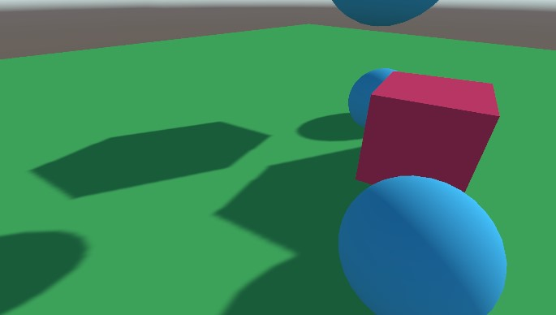
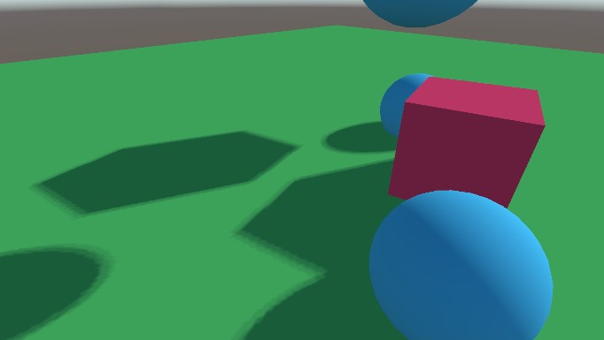

# Unity PCF (Poisson Sampling)

PCF (Percentage Closer Filtering) via Poisson sampling for Unity and Universal Render Pipeline.

> Built with Unity 2021.3.0f1 and URP v12.1.6
 

## Implementation

The project contains:
- A render feature to configure the poisson sampling parameters:
  - Spread
  - Mode
    - Disabled
    - Poisson Sampling
    - Poisson Sampling (Stratified)
    - Poisson Sampling (Rotated)
  - Samples Count (4 or 16)
- Lit Shader, which uses Poisson sampling to access shadow maps. Supports the following features:
  - Lambertian lighting
  - Shadow receiving/casting
  - Ambient lighting
- Editor utility to generate 3D Texture to sample rotations in the shader.
  - It can be accessed in `Window/Rendering/Rotated Poisson Sampling Texture Generator`.
  - The render feature uses the bundled 32x32x32 texture by default.

## Examples

Shadow resolution is set to 4096 in all examples.

Hard shadows (built-in)

Soft shadows (built-in)

Poisson Sampling
- Spread: 1200
- Samples 16

Poisson Sampling
- Spread: 1500
- Samples 4

Poisson Sampling (Stratified)
- Spread: 2000
- Samples: 16

Poisson Sampling (Rotated)
- Spread: 1000
- Samples: 16

## References

- http://www.opengl-tutorial.org/intermediate-tutorials/tutorial-16-shadow-mapping/#aliasing
- https://dev.theomader.com/shadow-quality-2/